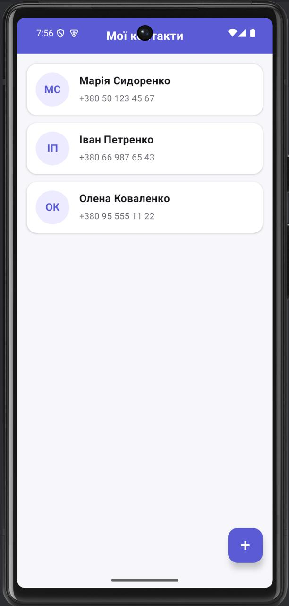
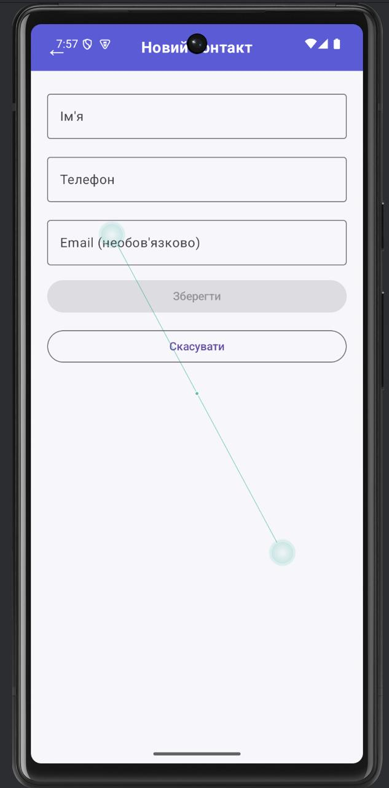
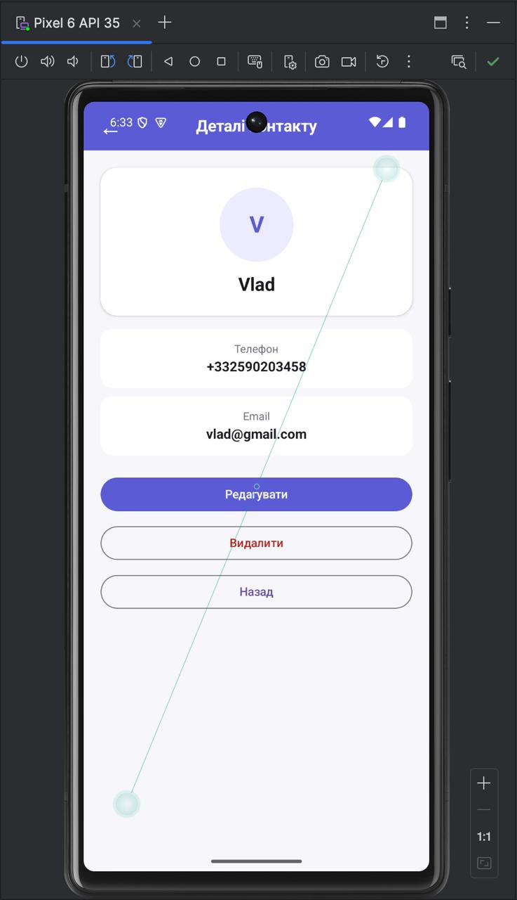

# Лабораторна робота №3

## Тема

**Навігація в Jetpack Compose**

## Варіант

**Варіант 2**

Студент: Громадченко Єгор
Група: АІ-233

## Мета роботи

Ознайомитися з принципами створення багатоекранних Android-застосунків за допомогою Jetpack Compose, реалізувати навігацію між екранами, передачу параметрів через маршрути та використати ViewModel для керування списком контактів.

## Завдання

Розробити Android-застосунок **«Мої контакти»**, який містить три основні екрани:

1. **ContactsListScreen** — список контактів.
2. **AddContactScreen** — додавання та редагування контакту.
3. **DetailsContactScreen** — перегляд детальної інформації про контакт.

У застосунку необхідно реалізувати:

- навігацію між екранами;
- передачу `contactId` як аргументу маршруту;
- додавання нових контактів;
- редагування контактів;
- видалення контактів;
- повернення на попередній екран за допомогою `popBackStack()`;
- використання `ViewModel` для керування списком контактів.

---

## Використані технології

- Kotlin
- Android Studio
- Jetpack Compose
- Navigation Compose
- ViewModel
- Material 3

---

## Структура проєкту

```text
com.example.mycontacts
│
├── data
│   └── Contact.kt
│
├── navigation
│   └── AppNavigation.kt
│
├── ui
│   ├── components
│   │   └── AppHeader.kt
│   │
│   ├── screens
│   │   ├── ContactsListScreen.kt
│   │   ├── AddEditContactScreen.kt
│   │   └── DetailsContactScreen.kt
│   │
│   ├── theme
│   │   └── ContactColors.kt
│   │
│   └── viewmodel
│       └── ContactsViewModel.kt
│
└── MainActivity.kt
```

---

# Хід роботи

## 1. Створення Android-проєкту

У середовищі Android Studio було створено новий проєкт на Kotlin з використанням Jetpack Compose.

Для реалізації переходів між екранами була додана бібліотека Navigation Compose.

---

## 2. Створення моделі контакту

Було створено клас `Contact`, який містить основні дані контакту:

- `id`;
- ім'я;
- номер телефону;
- email.

Приклад моделі:

```kotlin
data class Contact(
    val id: Int,
    val name: String,
    val phone: String,
    val email: String? = null
)
```

---

## 3. Реалізація ViewModel

Для керування даними було створено `ContactsViewModel`.

ViewModel відповідає за:

- зберігання списку контактів під час роботи застосунку;
- пошук контакту за ID;
- додавання нового контакту;
- редагування існуючого контакту;
- видалення контакту.

Основні функції:

```kotlin
fun getContactById(id: Int): Contact?
```

```kotlin
fun addContact(
    name: String,
    phone: String,
    email: String
)
```

```kotlin
fun updateContact(
    id: Int,
    name: String,
    phone: String,
    email: String
)
```

```kotlin
fun deleteContact(id: Int)
```

---

## 4. Реалізація екрана списку контактів

На екрані `ContactsListScreen` відображається список усіх контактів.

Для кожного контакту показано:

- ініціали;
- ім'я;
- номер телефону.

Також реалізована кнопка **«+»**, яка відкриває екран додавання нового контакту.

При натисканні на картку контакту виконується перехід на екран деталей з передачею ID контакту.

Маршрут:

```text
details/{contactId}
```

---

## 5. Реалізація додавання та редагування контакту

Екран `AddEditContactScreen` використовується для створення нового контакту та редагування існуючого.

Форма містить:

- поле для імені;
- поле для номера телефону;
- поле для email;
- кнопку **«Зберегти»**;
- кнопку **«Скасувати»**.

Після натискання кнопки **«Зберегти»** дані додаються або оновлюються у ViewModel, після чого застосунок повертається на попередній екран.

Кнопка **«Скасувати»** виконує повернення без збереження змін.

---

## 6. Реалізація екрана деталей контакту

Екран `DetailsContactScreen` отримує `contactId` як аргумент.

Після цього за допомогою ViewModel знаходиться потрібний контакт і відображаються:

- ім'я;
- номер телефону;
- email.

На екрані реалізовані кнопки:

- **«Редагувати»** — перехід на екран редагування;
- **«Видалити»** — видалення контакту;
- **«Назад»** — повернення на попередній екран.

---

## 7. Реалізація навігації

Для навігації використано:

- `NavController`;
- `NavHost`;
- `composable`;
- `navArgument`;
- `popBackStack()`.

Основні маршрути застосунку:

```text
contacts
```

```text
add_contact
```

```text
add_contact/{contactId}
```

```text
details/{contactId}
```

ID контакту передається між екранами як параметр маршруту.

Приклад переходу на екран деталей:

```kotlin
navController.navigate(
    "details/$contactId"
)
```

Повернення на попередній екран:

```kotlin
navController.popBackStack()
```

---

## 8. Перевірка роботи застосунку

Під час тестування було перевірено:

- відкриття списку контактів;
- перехід на екран деталей;
- правильну передачу `contactId`;
- додавання нового контакту;
- редагування імені, номера телефону та email;
- видалення контакту;
- роботу кнопок повернення;
- оновлення списку контактів після змін.

---

# Результат роботи

У результаті було створено Android-застосунок **«Мої контакти»** з трьома основними екранами та системою навігації.

У застосунку реалізовано:

- перегляд списку контактів;
- перегляд детальної інформації;
- додавання нових контактів;
- редагування даних;
- видалення контактів;
- передачу ID між екранами;
- керування даними через ViewModel;
- повернення між екранами через `popBackStack()`.

---

### Скріншоти роботи застосунку


## Список контактів



## Додавання контакту



## Деталі контакту



---

# Висновок

Під час виконання лабораторної роботи було створено багатоекранний Android-застосунок з використанням Jetpack Compose. Було реалізовано навігацію між екранами, передачу параметра `contactId`, керування списком контактів через ViewModel, а також операції додавання, редагування та видалення контактів.

У результаті виконання роботи було отримано практичні навички створення навігаційної структури Android-застосунку та передачі даних між екранами.
