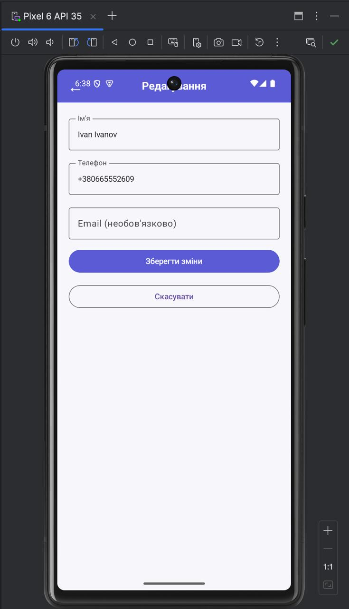
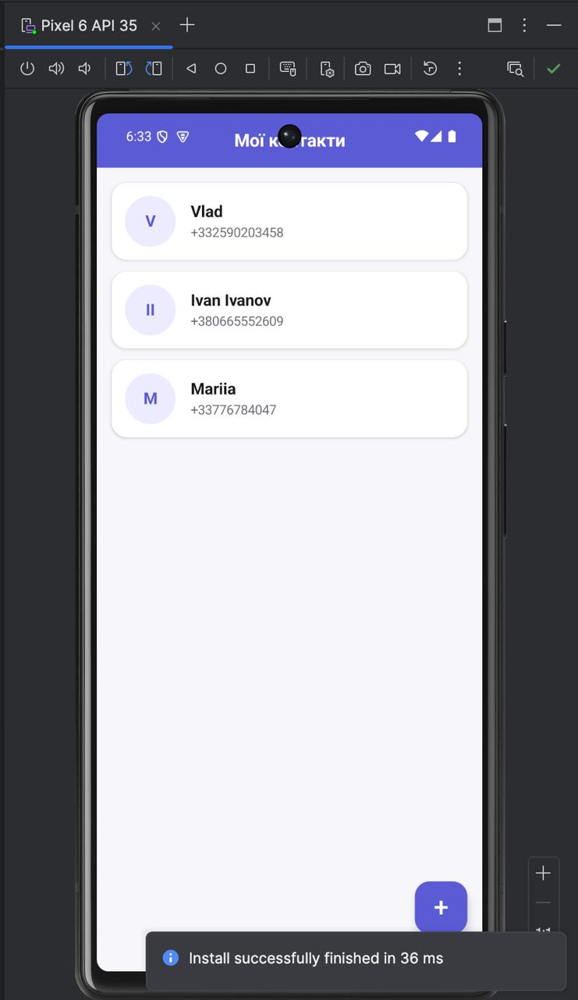

# Лабораторна робота №4

## Тема

**Додавання локальної бази даних Room та репозиторію до Android-застосунку**

## Варіант

Варіант 2
Студент: Громадченко Єгор
Група: АІ-233

## Мета роботи

Ознайомитися з принципами локального зберігання даних в Android-застосунках за допомогою бібліотеки Room та навчитися будувати багаторівневу структуру застосунку з розділенням відповідальності між UI, ViewModel, Repository, DAO та локальною базою даних.

У результаті виконання роботи необхідно реалізувати постійне зберігання контактів, щоб дані залишалися доступними після закриття та повторного запуску застосунку.

---

## Завдання

Необхідно доопрацювати застосунок **«Мої контакти»**, створений у лабораторній роботі №3.

Потрібно:

- додати залежності Room;
- створити Entity-клас `ContactEntity`;
- створити DAO-інтерфейс `ContactDao`;
- створити клас локальної бази даних `AppDatabase`;
- створити singleton-провайдер бази даних `DatabaseProvider`;
- створити `ContactRepository`;
- переписати `ContactsViewModel`, щоб він працював через Repository;
- підключити ViewModel до UI через `ViewModelProvider.Factory`;
- зберегти навігацію між трьома екранами;
- зберегти передачу `contactId` через маршрут;
- реалізувати додавання, редагування та видалення контактів;
- перевірити, що дані зберігаються після перезапуску застосунку.

---

## Архітектура застосунку

У лабораторній роботі №3 дані зберігалися у колекції всередині ViewModel.

```text
UI
↓
ContactsViewModel
↓
Колекція контактів
```

У лабораторній роботі №4 реалізовано нову структуру:

```text
UI
↓
ContactsViewModel
↓
ContactRepository
↓
ContactDao
↓
Room Database
```

Завдяки цьому UI не працює напряму з базою даних, а ViewModel не зберігає основний список контактів у колекції.

---

## Використані технології

- Kotlin
- Android Studio
- Jetpack Compose
- Navigation Compose
- ViewModel
- StateFlow
- Kotlin Coroutines
- Room
- KSP
- Material 3

---

## Структура проєкту

```text
com.example.mycontacts
│
├── data
│   ├── local
│   │   ├── AppDatabase.kt
│   │   ├── ContactDao.kt
│   │   ├── ContactEntity.kt
│   │   └── DatabaseProvider.kt
│   │
│   └── repository
│       └── ContactRepository.kt
│
├── navigation
│   └── AppNavigation.kt
│
├── ui
│   ├── components
│   │   └── AppHeader.kt
│   │
│   ├── screens
│   │   ├── ContactsListScreen.kt
│   │   ├── AddEditContactScreen.kt
│   │   └── DetailsContactScreen.kt
│   │
│   ├── theme
│   │   └── ContactColors.kt
│   │
│   └── viewmodel
│       ├── ContactsViewModel.kt
│       └── ContactsViewModelFactory.kt
│
└── MainActivity.kt
```

---

# Хід роботи

## 1. Підключення Room

До Android-проєкту було додано бібліотеку Room та KSP для генерації коду.

Приклад залежностей:

```kotlin
implementation("androidx.room:room-runtime:2.6.1")
implementation("androidx.room:room-ktx:2.6.1")
ksp("androidx.room:room-compiler:2.6.1")
```

Room використовується для збереження контактів у локальній базі даних.

---

## 2. Створення Entity-класу

Було створено файл:

```text
data/local/ContactEntity.kt
```

Клас `ContactEntity` представляє таблицю контактів у базі даних.

```kotlin
@Entity(tableName = "contacts")
data class ContactEntity(
    @PrimaryKey(autoGenerate = true)
    val id: Int = 0,
    val name: String,
    val phone: String,
    val email: String? = null
)
```

Поле `id` є первинним ключем та генерується автоматично.

Таблиця містить такі поля:

- `id`;
- `name`;
- `phone`;
- `email`.

---

## 3. Створення DAO

Було створено файл:

```text
data/local/ContactDao.kt
```

DAO містить методи для роботи з таблицею контактів.

Реалізовано:

- отримання всіх контактів;
- отримання контакту за ID;
- додавання контакту;
- оновлення контакту;
- видалення контакту.

Основні запити:

```kotlin
@Query("SELECT * FROM contacts ORDER BY id DESC")
fun getAllContacts(): Flow<List<ContactEntity>>
```

```kotlin
@Query("SELECT * FROM contacts WHERE id = :id")
fun getContactById(id: Int): Flow<ContactEntity?>
```

Також було використано анотації:

```text
@Insert
@Update
@Delete
```

---

## 4. Створення бази даних

Було створено файл:

```text
data/local/AppDatabase.kt
```

Клас наслідує `RoomDatabase`.

```kotlin
@Database(
    entities = [ContactEntity::class],
    version = 1,
    exportSchema = false
)
abstract class AppDatabase : RoomDatabase() {

    abstract fun contactDao(): ContactDao
}
```

У базі даних використовується одна основна таблиця:

```text
contacts
```

---

## 5. Створення DatabaseProvider

Було створено файл:

```text
data/local/DatabaseProvider.kt
```

У ньому реалізовано singleton-підхід для створення єдиного екземпляра бази даних.

База створюється з назвою:

```text
contacts_database
```

Основна логіка:

```kotlin
Room.databaseBuilder(
    context.applicationContext,
    AppDatabase::class.java,
    "contacts_database"
).build()
```

Це дозволяє використовувати один екземпляр бази даних у межах застосунку.

---

## 6. Створення Repository

Було створено файл:

```text
data/repository/ContactRepository.kt
```

`ContactRepository` є проміжним шаром між ViewModel та DAO.

Repository виконує такі операції:

- отримує список контактів;
- отримує контакт за ID;
- додає контакт;
- оновлює контакт;
- видаляє контакт.

Схема взаємодії:

```text
ContactsViewModel
↓
ContactRepository
↓
ContactDao
```

ViewModel не виконує SQL-запити та не звертається напряму до бази даних.

---

## 7. Оновлення ViewModel

Було переписано файл:

```text
ui/viewmodel/ContactsViewModel.kt
```

У лабораторній роботі №3 список контактів зберігався безпосередньо у ViewModel.

У лабораторній роботі №4 цей підхід було замінено на отримання даних через Repository.

Список контактів представлений як `StateFlow`:

```kotlin
val contacts: StateFlow<List<ContactEntity>> =
    repository.contacts.stateIn(
        scope = viewModelScope,
        started = SharingStarted.WhileSubscribed(5000),
        initialValue = emptyList()
    )
```

Операції додавання, редагування та видалення виконуються у `viewModelScope`.

Приклад додавання:

```kotlin
viewModelScope.launch {
    repository.addContact(contact)
}
```

Таким чином, ViewModel керує станом UI, але не зберігає список контактів у локальній колекції.

---

## 8. Створення ViewModelFactory

Оскільки `ContactsViewModel` отримує `ContactRepository` через конструктор, було створено файл:

```text
ui/viewmodel/ContactsViewModelFactory.kt
```

Фабрика створює ViewModel та передає в нього Repository.

```kotlin
return ContactsViewModel(
    repository = repository
) as T
```

---

## 9. Підключення бази даних у MainActivity

У `MainActivity.kt` створюються:

1. база даних;
2. Repository;
3. ViewModelFactory;
4. ContactsViewModel.

Схема ініціалізації:

```text
DatabaseProvider
↓
AppDatabase
↓
ContactDao
↓
ContactRepository
↓
ContactsViewModelFactory
↓
ContactsViewModel
```

Після цього ViewModel передається у навігацію:

```kotlin
AppNavigation(
    viewModel = viewModel
)
```

---

## 10. Оновлення екрана списку контактів

`ContactsListScreen` отримує список контактів із ViewModel.

У навігації список збирається з `StateFlow`:

```kotlin
val contacts by viewModel.contacts.collectAsState()
```

Після цього список передається на екран:

```kotlin
ContactsListScreen(
    contacts = contacts,
    onAddClick = { ... },
    onContactClick = { ... }
)
```

UI не звертається до DAO або Room Database напряму.

---

## 11. Оновлення екрана деталей контакту

Екран деталей продовжує отримувати `contactId` через маршрут навігації.

Маршрут:

```text
details/{contactId}
```

За отриманим ID ViewModel повертає контакт через Repository:

```kotlin
val contact by viewModel
    .getContactById(contactId)
    .collectAsState(initial = null)
```

На екрані відображаються:

- ім'я;
- номер телефону;
- email.

Також працюють кнопки:

- **Редагувати**;
- **Видалити**;
- **Назад**.

---

## 12. Оновлення екрана додавання та редагування

Екран `AddEditContactScreen` використовується у двох режимах:

- додавання нового контакту;
- редагування існуючого контакту.

Для додавання викликається:

```kotlin
viewModel.addContact(
    name = name,
    phone = phone,
    email = email
)
```

Для редагування викликається:

```kotlin
viewModel.updateContact(
    id = contactId,
    name = name,
    phone = phone,
    email = email
)
```

Після збереження застосунок повертається на попередній екран за допомогою:

```kotlin
navController.popBackStack()
```

---

## 13. Навігація

У застосунку збережено всі маршрути з лабораторної роботи №3:

```text
contacts
```

```text
add_contact
```

```text
add_contact/{contactId}
```

```text
details/{contactId}
```

Передача `contactId` через маршрут використовується для відкриття деталей контакту та редагування контакту.

---

## 14. Перевірка роботи застосунку

Під час тестування було виконано такі дії:

1. Запущено застосунок.
2. Додано декілька контактів.
3. Відкрито деталі одного контакту.
4. Змінено ім'я, номер телефону або email.
5. Видалено один контакт.
6. Застосунок було закрито.
7. Застосунок було повторно запущено.
8. Перевірено наявність контактів, які не були видалені.
9. Перевірено повторне відкриття деталей збереженого контакту.

Після повторного запуску дані залишаються у списку, оскільки вони зберігаються у локальній базі Room.

---

# Результат роботи

У результаті було доопрацьовано застосунок **«Мої контакти»** та додано локальну базу даних Room.

Було реалізовано:

- `ContactEntity`;
- `ContactDao`;
- `AppDatabase`;
- `DatabaseProvider`;
- `ContactRepository`;
- оновлений `ContactsViewModel`;
- `ContactsViewModelFactory`;
- роботу UI через ViewModel;
- отримання даних через Flow та StateFlow;
- додавання контактів у Room;
- редагування контактів;
- видалення контактів;
- постійне збереження даних після перезапуску застосунку.

---

## Скріншоти роботи застосунку

### Список контактів


### Додавання контакту


### Деталі контакту


### Редагування контакту





### Дані після повторного запуску





---

# Висновок

Під час виконання лабораторної роботи було доопрацьовано Android-застосунок **«Мої контакти»** та замінено тимчасове зберігання даних у ViewModel на роботу з локальною базою даних Room.

Було реалізовано багаторівневу структуру:

```text
UI
↓
ViewModel
↓
Repository
↓
DAO
↓
Room Database
```

У результаті застосунок зберігає контакти після закриття та повторного запуску, а UI працює з даними тільки через ViewModel. Під час виконання роботи було отримано практичні навички використання Room, DAO, Repository, Flow, StateFlow та ViewModelFactory у Jetpack Compose.
